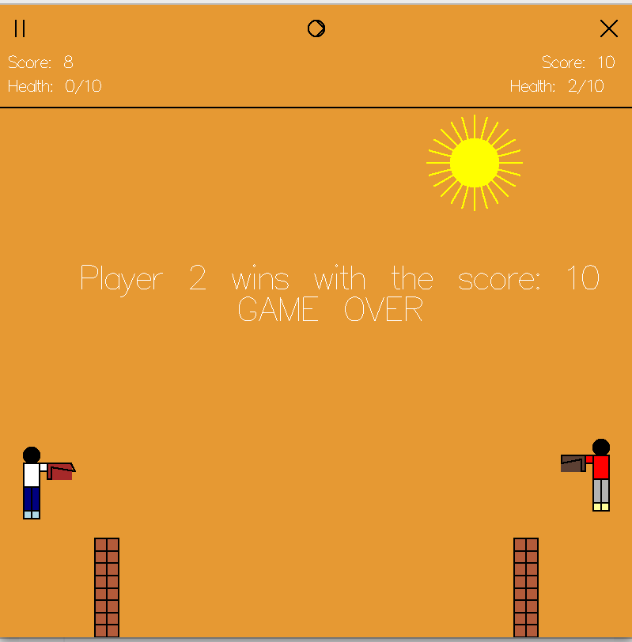
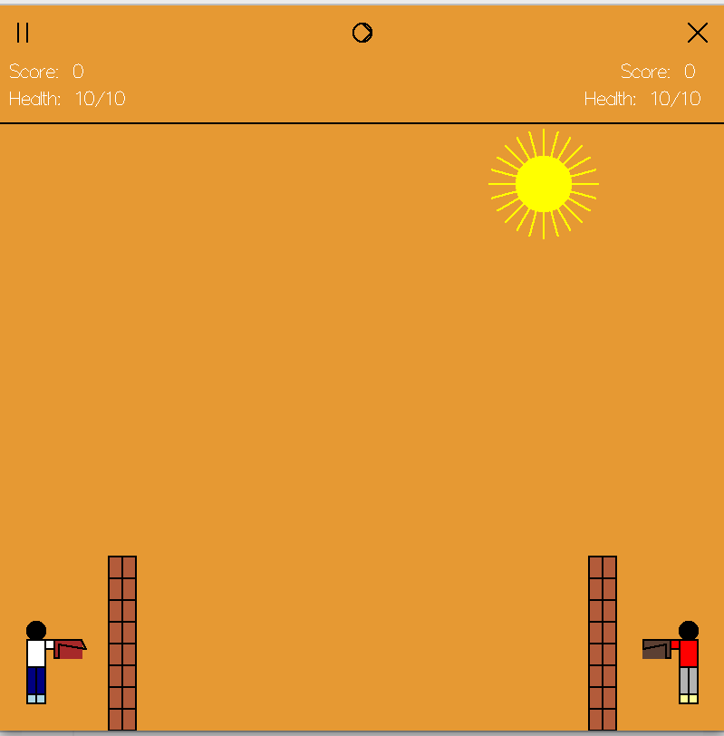
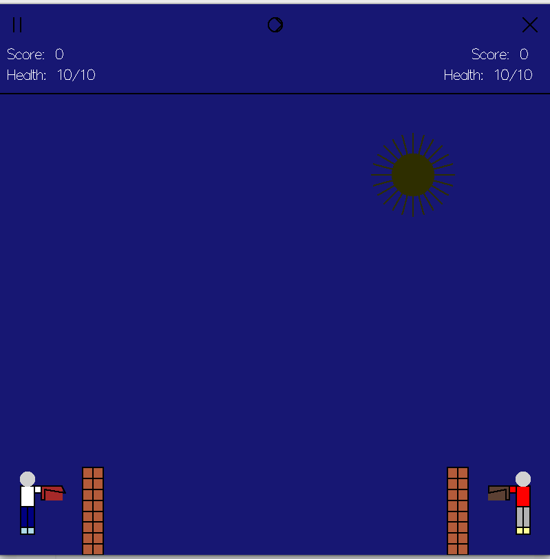

# 2D Shooting Game (OpenGL)

 *(add a screenshot if available)*

## Overview
A 2D shooting game built with Python and OpenGL featuring dynamic day-night cycles, destructible environments, and dual-player combat.

## Features
- **Two-Player Combat**:  
  - Player 1 (Left): `W/S` to move, `D` to shoot  
  - Player 2 (Right): `↑/↓` to move, `←` to shoot  
- **Dynamic Environment**:  
  - Day-night cycle (`N/M` keys) with shifting backgrounds  
  - Procedurally degrading walls for tactical cover  
- **Game Mechanics**:  
  - Health system (10 HP per player)  
  - Real-time scoring  
  - Bullet collision detection  
- **Controls**:  
  - Pause/Resume ⏯️  
  - Restart 🔄  
  - Exit ❌  

## Development Team
- **[Asir Adnan]**: Core gameplay (movement, bullets, collision)  
- **[Ramisa Anjum]**: Visual design (colors, sprites, effects)  
- **[Md Anwar Hossain]**: Printing texts, debugging & quality assurance  

## Technical Implementation
- **Rendering**:  
  - OpenGL immediate mode + GLUT  
  - Custom Midpoint algorithms for lines/circles  
- **Systems**:  
  - Multithreaded player/bullet movement  
  - Linear interpolation for day-night transitions  
- **Structure**:  
  - Procedural object drawing (no external assets)  

## How to Run
```bash
git clone https://github.com/asiradnan/Lethal-Height.git
cd Lethal-Height
python Game.py
```

## Game Rules
<ol>
  <li>Reduce opponent's health to zero to win.</li>
  <li>Walls block bullets but decay over time</li>
  <li>Cooldown of 0.5s between shots.</li>
</ol>

## Screenshots

  
*Day mode with bright background and visible sun*

  
*Night mode with dark environment and glowing elements*

  
*Victory screen showing winner and final scores*

## Future Enhancements
- Sound effects
- Power-ups (rapid fire, health packs)
- Particle effects for explosions

*Developed as a Computer Graphics course project.*